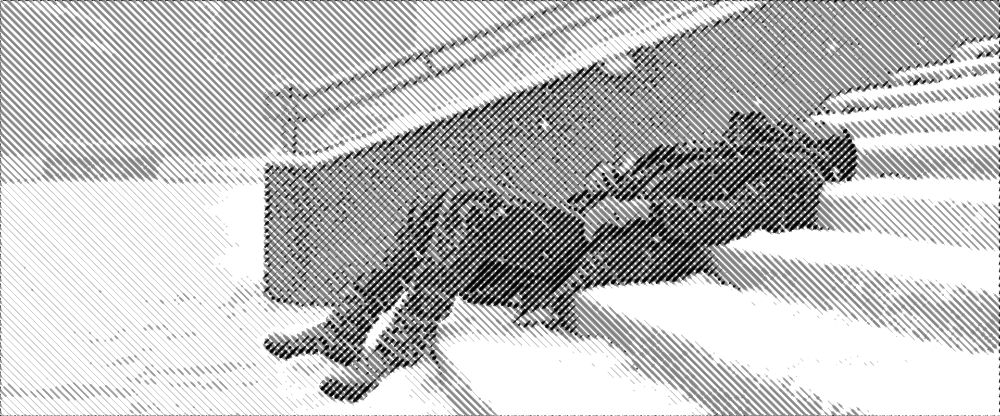
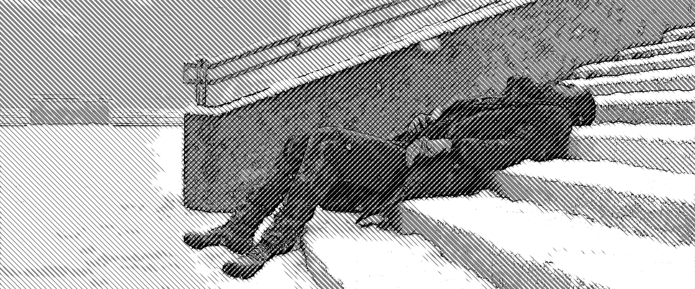

# Halftone

This project is a Java Maven application built using NetBeans IDE and Swing that applies the effect of **halftone** to a image.

  
  

  
  

## **Features**

- **Apply Halftone Effect**: Apply a halftone effect to images.
- **Image Upload**: Easily upload images by dragging and dropping them into the application.
- **Adjust Halftone Scale**: Use a slider to adjust the scale of the halftone effect, ranging from 0 to 100.
- **Set Angle**: Use a slider to adjust the angle of the halftone pattern, with values from 0 to 360 degrees, to customize the visual effect.

## **How it works**

  

**1.** First we need to rotate the image based on our `angle`, our rotated image should be larger to fit the full image and its corners, accounting for the rotation.

  

**2.** We can break this rotated image into horizontal groups or "kernels", each kernel can then be broken into vertical segments. 

Width of segment is given by the `horizontal blur` value, while the height is the `scale`/`kernel size`.

We can then obtain the average luminance of the pixels within each segment, returning a value between 0 and 255.

Then use this value to generate a vertical (y axis) offset value within this segment. This will result in 2 offsets, one negative and another positive.

  

**3.** Now that we have a array of negative and positive offsets we can then use this value to draw a complex polygon.

If we imagine two identical lines that span the entire kernel horizontaly, we can say that these lines are made of many vertices, one for each segment.

We then go left to right through our array of offsets, getting first all negative offset values of every segment within the kernel and applying them to the y position of the respective vertice of line 1. Then we go from right to left in the array and apply the positive offsets to line 2.

Now we have two identical lines one above the other, but with their y values being opposite, if we then connect these two lines at their end points we can make a complex shaped polygon.

Notice how we are representing luminosity within an area in a similar way we represent sound visually, with the magnitude equating to shade of color.

**4.** By step 3 we already have our halftone line effect to our image, now we are just going do a simple vertical blur to add a bit of anti-alliasing to the image and then fix the rotation back to original angle and image size.

## **Example of effect**

  
  

  

We can do some cool effects by overlaying halftones of an image in different angles, creating a cross hatching pattern. This specific effect can be obtained by having two versions of the same image, but with different levels of darkness (working similar to a z-buffer but in a 2D image) apply the halftone in perpendicular angles, the image which covers more of the screen is then made 50% opaque.

  

This effect can be made even better by giving our image a outline, in this case I used my own ExDoG (Extended Difference of Gaussians) code to generate this outline.

## **TODO**

- **Dot Halftone**: While there is a button to choose the dot pattern for the halftone, it's currently non-functional, I will be working on it later.
- **Extra Control**: In the code there is already functionality to change things such as the spacing within the pattern, control the vertical blur size, control segment sample size, I simply have yet to implement the user controls in the UI.
- **Transparent**: I'm thinking about adding a option to have a transparent background in the output, maybe.
