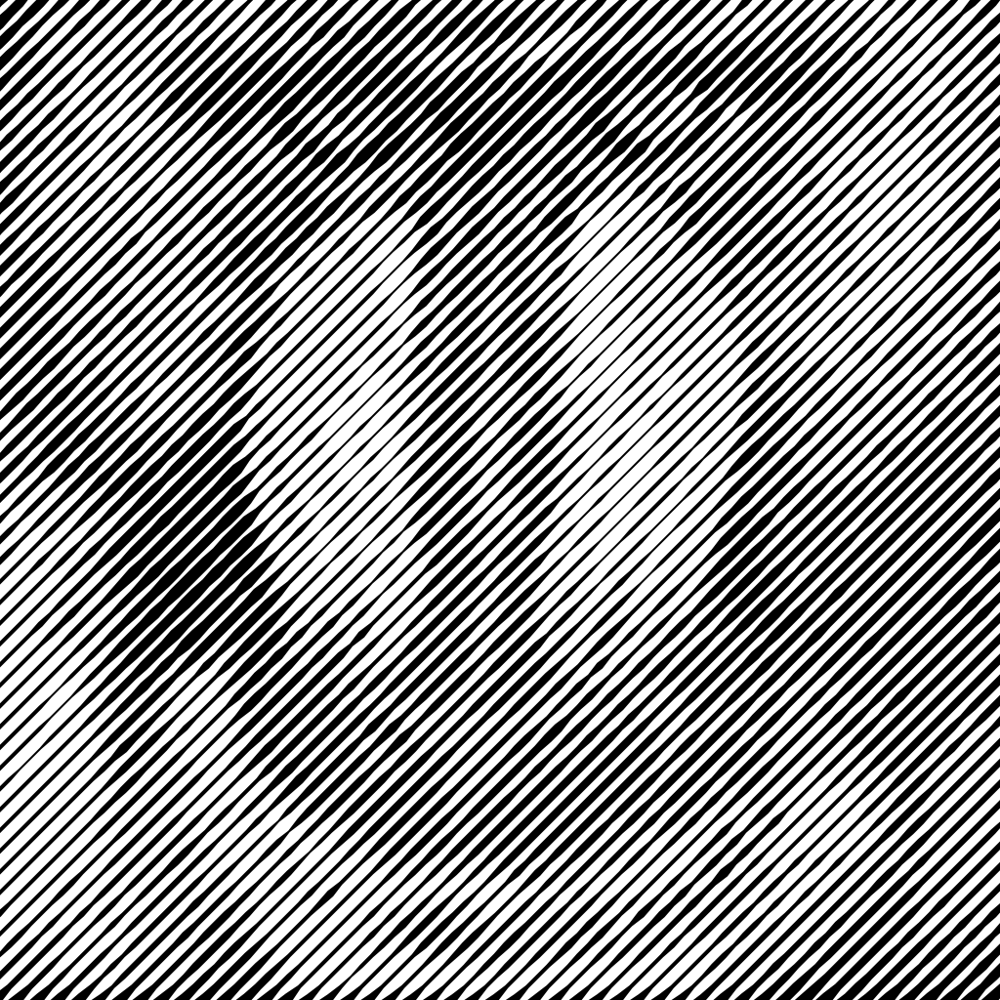

# Halftone

This project is a Java Maven application built using NetBeans IDE and Swing that applies the effect of **halftone** to an image, using patterns like dots, lines, squares, triangles, or sine waves. This version introduces a **dual ComboBox interface** for selecting both the **halftone type** (`TYPE`) and **operation mode** (`OpType`), allowing full RGB or CMYK processing. The project leverages code from [my other project to separate CMYK/RGB colors](https://github.com/PedroFellipeAntunes/color-separator-java).

<p align="center">
  <table align="center">
    <tr>
      <td>
        <table>
          <tr>
            <td>
              
            </td>
            <td>
              
            </td>
          </tr>
          <tr>
            <td>
              
            </td>
            <td>
              
            </td>
          </tr>
        </table>
      </td>
      <td>
        
      </td>
    </tr>
  </table>
</p>

---

## Table of Contents

1. [Features](#features)  
2. [Usage](#usage)  
3. [How It Works](#how-it-works)  
4. [Additional Examples](#additional-examples)  

---

## Features

- **Apply Halftone Effect**  
  - Patterns: `Dots`, `Squares`, `Triangles`, `Lines`, `Sine Waves`.
- **Full CMYK and RGB Processing**  
  - Separates image into CMYK channels (or keeps RGB), applies halftone at fixed angles, and merges using multiply blend.
- **Dual ComboBox Interface**  
  - Select both **TYPE** (pattern) and **OpType** (operation mode) without affecting layout.  
  - ComboBoxes now occupy the **full width** of the control panel for better usability.
- **Drag & Drop Support**  
  - Simply drag images into the interface to process them.
- **Interactive Controls**  
  - Adjust halftone scale (0–100) and angle (0°–360°) via sliders for live preview.
- **Batch Processing**  
  - Drop multiple images at once; each will be processed and automatically saved.
- **Color Picker Support**  
  - Background and foreground colors can be selected for custom halftone effects.
- **Live Feedback**  
  - Real-time update of processing state, preventing controls from being modified mid-processing.

---

## Usage

1. **Open the Application**  
   - Double-click `Halftone.jar`, or run:  
     ```
     java -jar Halftone.jar
     ```

2. **Configure Settings**  
   - **Pattern (TYPE):** Choose between Dots, Squares, Triangles, Lines, or Sine Waves.  
   - **Operation Mode (OpType):** Choose the processing mode (Default, CMYK, etc.).  
   - **Scale Slider:** Adjust the size of the halftone elements (0 = minimum, 100 = maximum).  
   - **Angle Slider:** Define the angle of the halftone pattern (0°–360°).  
   - **Color Mode (CMYK Toggle):** Enable/disable per-channel halftone.  
   - **Color Pickers:** Select background and foreground colors for halftone elements.

   <p align="center">
     
   </p>

3. **Drag & Drop**  
   - Drag one or more images (JPEG, PNG, JPG) directly into the window.

4. **Preview and Save**  
   - A live preview will display the result.  
   - Processed images are automatically saved in the same folder as the originals using this pattern:  
     ```
     originalname_Halftone[type,scale,angle].png
     ```
   - Example: `cameraman_Halftone[Lines,50,45.0].png`

---

## How It Works

Below is a high-level overview of the halftone algorithm:

1. **Kernel Generation**  
   - Divide the image into square blocks (“kernels”), each rotated by the chosen angle.  
   - For each kernel, sum the RGB values and compute the average.

   <p align="center">
     
   </p>

2. **Luminance Calculation**  
   - Within each kernel, convert the average color to luminance.  
   - Determine a center point and compute two offset points based on luminance, constrained to half the kernel size.

   <p align="center">
     
   </p>

3. **Polygon Filling**  
   - Negative offsets define the top of a polygon, positive offsets define the bottom.  
   - Connect these points along each row to create a complex shape that follows the image’s contours at the given angle.

   <p align="center">
     
   </p>

4. **CMYK or RGB Processing (Optional)**  
   - In CMYK mode, repeat steps 1–3 for each channel (Cyan, Magenta, Yellow, Key/Black) using fixed angles.  
   - In RGB mode, halftone is applied directly to the original image channels.  
   - Finally, channels are blended using multiply to create the full-color halftone output.

---

## Additional Examples

<p align="center">
  
  
  
  
  
</p>

<p align="center">
  
</p>

<p align="center">
  
  
</p>

Overlaying halftones at opposing angles with a dark layer at 50% opacity creates a cross-hatching effect.

<p align="center">
  
</p>

This effect can be further enhanced by generating an outline using Extended Difference of Gaussians (XDoG).

<p align="center">
  
</p>
