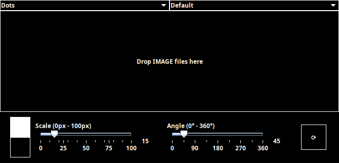

# Halftone

This project is a Java Maven application built using NetBeans IDE and Swing that applies the effect of **halftone** to an image, with dots, lines or sine waves as the pattern. This code uses a codebase from my other project to [separate the CMYK/RGB colors](https://github.com/PedroFellipeAntunes/color-separator-java).

<p align="center">
  <table align="center">
    <tr>
      <td>
        <table>
          <tr>
            <td>
              
            </td>
            <td>
              
            </td>
          </tr>
          <tr>
            <td>
              
            </td>
            <td>
              
            </td>
          </tr>
        </table>
      </td>
      <td>
        
      </td>
    </tr>
  </table>
</p>

---

## Table of Contents

1. [Features](#features)  
2. [Usage](#usage)  
3. [How It Works](#how-it-works)  
4. [Additional Examples](#additional-examples)  

---

## Features

- **Apply Halftone Effect**  
  - Patterns: `Dots`, `Polygons`, `Triangles`, `Stippling`, `Lines`, `Sine Waves`.
- **Full CMYK/RGB Processing**  
  - Separates image into CMYK/RGB channels, applies halftone at predetermined angles, and merges using multiply/screen blend.
- **Drag & Drop Support**  
  - Simply drag images into the interface to process them.
- **Interactive Controls**  
  - Adjust halftone scale (0–100) and angle (0°–360°) via sliders for live preview.
- **Batch Processing**  
  - Drop multiple images at once; each will be processed and automatically saved.

---

## Usage

1. **Open the Application**  
   - Double-click `Halftone.jar`, or run:  
     ```
     java -jar Halftone.jar
     ```

2. **Configure Settings**  
   - **Pattern:** Choose between Dots, Squares, Triangles, Lines or Sine Waves.  
   - **Scale Slider:** Adjust the size of the halftone elements (0 = minimum, 100 = maximum).  
   - **Angle Slider:** Define the angle of the halftone pattern (0°–360°).  
   - **Color Mode:** Choose between Default, CMYK or RGB for color processing.

   <p align="center">
     
   </p>

3. **Drag & Drop**  
   - Drag one or more images (JPEG, PNG, JPG) directly into the window.

4. **Preview and Save**  
   - A live preview will display the result.  
   - To save, click **Save** or close the window. Processed images are saved in the same folder as the originals with this pattern:  
     ```
     originalname_Halftone[type;scale;angle].png
     ```
   - Example: `cameraman_Halftone[Lines;50;45.0].png`

---

## How It Works

Below is a high-level overview of the halftone algorithm (example based on line/sine patterns):

1. **Kernel Generation**  
   - Divide the image into square blocks (“kernels”), each rotated by the chosen angle.  
   - For each kernel, sum up the RGB values and compute the average.

   <p align="center">
     
   </p>

   To better understand the logic behind the kernels try out my [kernel simulator](https://kernel-simulator.vercel.app/)!

2. **Luminance Calculation**  
   - Within each kernel, convert the average color to luminance.  
   - Determine a center point and compute two offset points based on luminance, constrained to half the kernel size.

   <p align="center">
     
   </p>

3. **Polygon Filling**  
   - Negative offsets define the top of a polygon, positive offsets define the bottom.  
   - Connect these points along each row to create a complex shape that follows the image’s contours at the given angle.

   <p align="center">
     
   </p>

4. **CMYK/RGB Processing (Optional)**  
   - When CMYK/RGB mode is enabled, repeat steps 1–3 for each channel using fixed angles (e.g., CMYK(15°, 75°, 0°, 45°) or RGB(0º, 60º, 120º).  
   - Finally, blend all channels using a multiply/screen operation to obtain the full-color halftone result.

---

## Additional Examples

Angles:

<p align="center">
  
  
  
  
  
</p>

Wave crosshatching:

<p align="center">
  
</p>

Stippling:

<p align="center">
  
</p>

Overlaying halftones at opposing angles to create a cross-hatching effect. This effect can be further enhanced by generating an outline (e.g., with Extended Difference of Gaussians).

<p align="center">
  <table align="center">
    <tr>
      <td>
        
      </td>
      <td>
        
      </td>
    </tr>
  </table>
</p>

---
